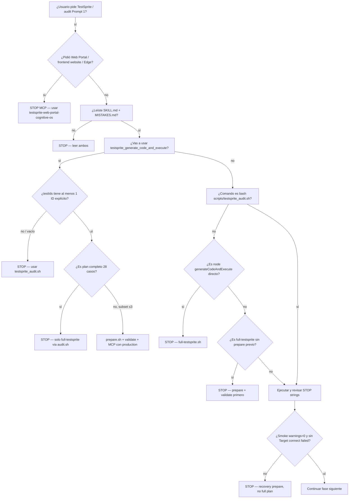

# Árbol de decisión — TestSprite Cognitive OS

Usar **antes** de invocar cualquier tool MCP o comando shell ad-hoc.

## Preguntas de 5 segundos (responder en voz alta)

1. ¿El usuario pidió explícitamente Web Portal/frontend de TestSprite? Si sí → usar `testsprite-web-portal-cognitive-os`, no MCP.
2. ¿Mi comando es **`bash scripts/testsprite_audit.sh`**? Si no y es MCP/local → parar.
3. ¿`testIds` está **vacío** en algún JSON MCP? Si sí → parar.
4. ¿Corrí **prepare + validate** en esta sesión? Si no → parar.
5. ¿Hay **URLs** en `additionalInstruction` para MCP? Si sí → parar.
6. ¿Voy a declarar **PASS** sin contar 28 en batched_results o sin reporte portal limpio? Si sí → parar.

## Veredictos permitidos

| Evidencia | Veredicto TestSprite |
|---|---|
| 28/28 PASSED, warnings=0 | PASS |
| Subset OK (ej. TC001 smoke) | PARTIAL (documentar scope) |
| Tunnel bug / sin key / abort | BLOCKED + fallback QA |
| pytest verde pero TestSprite no | PASS producto, BLOCKED TestSprite |
