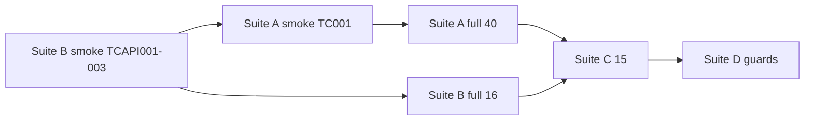

# 03 — TestSprite Master Blueprint (Cognitive OS · Cursor)

Fecha: **2026-05-26**  
Fuentes primarias: `/home/jgonz/Escritorio/testsprite/PRD.md`, `PRD_FRONTEND.md`, `PRD_BACKEND.md`  
Contexto secundario: `docs/CURRENT_STATE.md`, `ZERO_FRICTION_OPERATING_MODEL.md`, `ACTION_PLANE.md`

## Postura de producto bajo audit

- Local-first, single-operator, PC dedicado.
- Perfil objetivo: `OPERATOR_PROFILE=dedicated_local`, `LOCAL_AUTONOMY_MODE=full`, `CODE_DIRECTOR_BUDGET_MODE=soft`.
- Prioridad: **cero fricción operativa** > seguridad SaaS estricta.
- Controles duros: trazabilidad, idempotencia, health honesto, no side effects peligrosos, no 5xx inesperados.

## Targets públicos (Megaprompt 2)

| Rol | URL |
|---|---|
| Frontend SPA | `https://cognitive.doctormanzur.com` |
| Backend API | `https://cognitive-api.doctormanzur.com` |
| OpenAPI | `https://cognitive-api.doctormanzur.com/openapi.json` |

## Instrucciones globales TestSprite (pegar en cada suite)

```
Product: Cognitive OS — dedicated_local/full — zero operational friction.
Frontend is SPA: ONLY navigate /. Tabs via sidebar, hotkeys 1-9, Ctrl+K palette.
DO NOT navigate to /dashboard, /health, /mail, etc. (404 by design).

Before UI tests, seed:
  localStorage.setItem('cogos.token', '<JWT>');
  localStorage.setItem('cogos.api', 'https://cognitive-api.doctormanzur.com');
  reload /

API tests: Authorization: Bearer <JWT>
401 without JWT is EXPECTED — not a bug.
403/409 on forbidden writes is EXPECTED — not a bug.

FORBIDDEN side effects:
- no email send/draft
- no DNS writes
- no destructive filesystem/sandbox
- no safety flag mutation
- no admin JWT rotation

Fail on: crash, white screen, hidden errors, 5xx, false green health, side effects.
Empty tables with clear empty states = PASS.
LLM latency outliers = acceptable if UI/API degrades clearly.
```

---

## SUITE A — UI SPA FULL

**Objetivo:** Validar cockpit completo en origen público como SPA autenticada.

| Campo | Valor |
|---|---|
| Base URL | `https://cognitive.doctormanzur.com` |
| Auth | localStorage seed (doc 02) |
| Plan MCP | `testsprite_tests/testsprite_frontend_test_plan.json` (40 casos) |
| Export | `04_UI_PLAN.md` |

### Precondiciones

- Runtime público UP (doc 01).
- JWT en `/tmp/cognitive_os_testsprite_cursor_jwt.txt`.
- TestSprite config/instrucciones apuntan a URL pública (no túnel localhost).

### Cobertura mapeada PRD → plan

| Área PRD | Casos plan / gap |
|---|---|
| Bootstrap + Connected | TC001–TC003 (ajustar pre-step localStorage público) |
| Sidebar + tabs | TC005, TC025 |
| Command palette | TC015, TC017, TC021, TC022, TC029 |
| Hotkeys 1–9 | **GAP** — añadir en Megaprompt 2 |
| Dashboard | TC005 (parcial) |
| Chat | TC004, TC008 |
| Health | TC006–TC009 |
| Documents | TC012, TC016 |
| Document Analysis | TC010, TC020 |
| Jobs / Approvals / Actions | TC014, TC018, TC035 |
| Mail read-only | TC024, TC027, TC032, TC040 |
| Research / DeepAgents | TC011, TC021 |
| Code Director | TC019, TC023 |
| MCP / System | TC033, TC034 |
| Memory / Skills | TC028, TC036, TC037 |
| Google Ops | TC026, TC030, TC039 |
| Configuration / readiness | TC013, TC031 |
| Responsive | **GAP** |
| No localhost fetch | **GAP** — caso manual TE2E014 |
| Console critical errors | implícito en todos |

### Pasos operativos (Megaprompt 2)

1. Bootstrap frontend con instrucciones públicas + `needLogin: false`.
2. Ejecutar batches `testIds` explícitos (batch size 1 recomendado).
3. Exportar `testsprite_tests/tmp/batched_results.json`.

### Expected

- Terminal state ≤10s por tab.
- TopBar Connected tras seed.
- Sin hydration/chunk errors.

### Out-of-scope

- Enviar mail, drafts, DNS write, sandbox destructivo.

### Severidad

- P0: crash SPA, 401 persistente post-seed, send UI visible.
- P1: tab core rota (Health, Chat, Jobs).
- P2: empty state sin guía, palette rota.

### Artefactos

- Screenshots/video TestSprite por fallo.
- `04_UI_PLAN.md`, `batched_results.json`, summary sanitizado.

---

## SUITE B — API CONTRACT FULL

**Objetivo:** Contrato REST público completo sin side effects.

| Campo | Valor |
|---|---|
| Base URL | `https://cognitive-api.doctormanzur.com` |
| Auth | Bearer JWT |
| OpenAPI | cargar en instrucciones / casos TCAPI001 |
| Plan | `testsprite_backend_test_plan.json` (16 casos TCAPI001–016) |
| Export | `05_API_PLAN.md` |

### Precondiciones

- Regenerar plan requiere `testsprite_bootstrap` con `type: backend`.
- JWT admin válido.

### Cobertura

| PRD Backend J | Caso |
|---|---|
| J1 Liveness | TCAPI001 |
| J2 Readiness/info | TCAPI002, TCAPI014 |
| J3 Catalogs | TCAPI004, TCAPI008 |
| J4 Chat | TCAPI009 |
| J5 Documents | TCAPI010 |
| J6 Approvals/audit | TCAPI004 |
| J7 Jobs | TCAPI004, TCAPI013 |
| J8 DeepAgents | TCAPI008, TCAPI011 |
| J9 Auth negative | TCAPI003 |
| J10 CORS | TCAPI005 |
| Guards/mail | TCAPI006, TCAPI007, TCAPI015, TCAPI016 |
| Action plane | TCAPI012 |
| Invalid UUID | TCAPI013 |

### Expected

- 4xx controlados en guards; nunca 5xx en paths normales.
- Sin valores secret-shaped en bodies.

### Out-of-scope

- POST mail send/sync/dispatch en suite normal (solo guard suite).

### Severidad

- P0: 5xx en GET core, leak credencial.
- P1: auth guard roto (200 sin token).
- P2: schema drift menor documentado.

### Artefactos

- Request/response enmascarados, `05_API_PLAN.md`.

---

## SUITE C — E2E INTEGRATED

**Objetivo:** UI pública + API pública coherentes extremo a extremo.

| Campo | Valor |
|---|---|
| Plan | Manual `06_E2E_PLAN.md` (15 casos TE2E001–015) |
| Razón | MCP no expone generador E2E dedicado |

### Precondiciones

- Suites A y B smoke OK.
- Mismo JWT + localStorage seed.

### Cobertura clave

- Connected + Health tab vs `/health/dashboard`.
- Jobs/Approvals tabs vs API.
- Chat roundtrip o degraded honesto.
- Mail read-only UI.
- Action Plane preview guard.
- dedicated_local/full sin fricción redundante.
- Network: no localhost, no CORS, no mixed-content.

### Expected

- UI refleja estado real backend (no badges mentirosos).

### Artefactos

- Network HAR/screenshots, correlación tab ↔ endpoint.

---

## SUITE D — FORBIDDEN / GUARD NEGATIVE

**Objetivo:** Side effects peligrosos bloqueados sin 5xx.

| Campo | Valor |
|---|---|
| Plan | `07_GUARD_PLAN.md` (TG001–TG011) + TCAPI006/007/016 |
| Mix | API negative + UI blocked banners (TC034) |

### Cobertura

- Mail send/draft/sync POST blocked.
- DNS dry-run only.
- Sandbox/dangerous tools 403/409.
- Safety flags immutables en UI.
- Idempotencia/double approve.
- Forbidden POST → 4xx/409, never 500.

### Expected

- `detail` tipo `feature_disabled`, `dry_run_only`, `forbidden`.

### Out-of-scope

- Bypass intentional de guards.

---

## Orden de ejecución recomendado (Megaprompt 2)



## Mapping archivos

| Suite | Markdown | JSON origen |
|---|---|---|
| A UI | `04_UI_PLAN.md` | `testsprite_frontend_test_plan.json` |
| B API | `05_API_PLAN.md` | `testsprite_backend_test_plan.json` |
| C E2E | `06_E2E_PLAN.md` | manual |
| D Guard | `07_GUARD_PLAN.md` | manual + API subset |

## PRD assets en repo

Copiados a `testsprite_tests/tmp/prd_files/`:

- `PRD.md`, `PRD_FRONTEND.md`, `PRD_BACKEND.md`, `cognitive-os-launchers-README.md`

TestSprite standardized PRD: `testsprite_tests/standard_prd.json`
